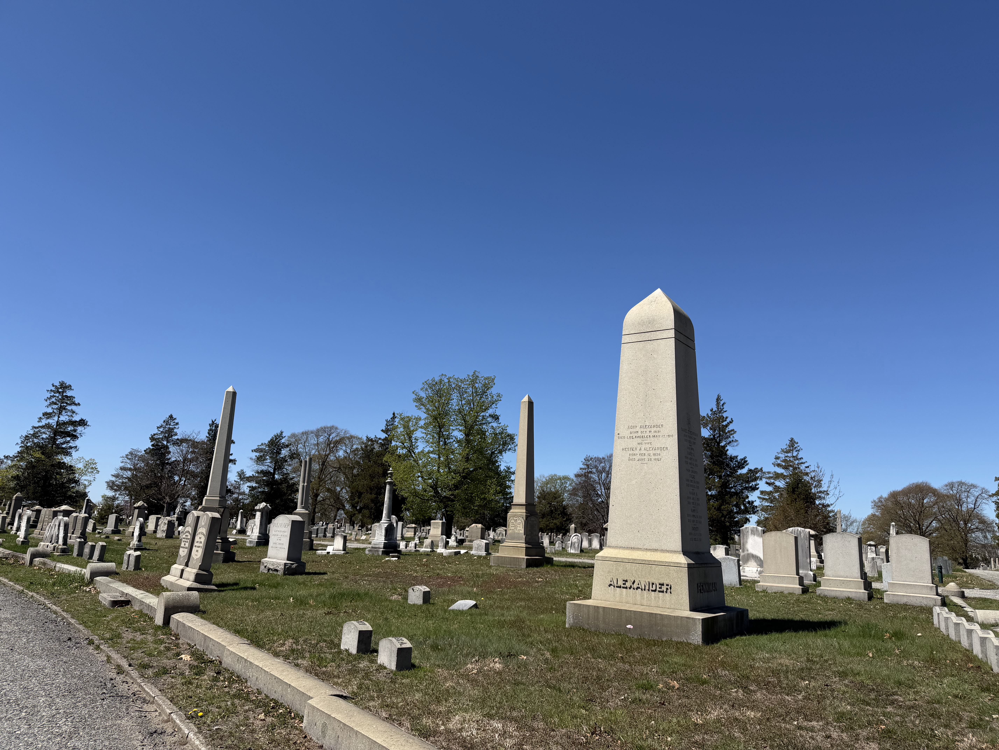

{fig-align="center"}

As Above/So Below is a working group that was initially inspired by the [AASLH-NCPH 2026 Annual Meeting](https://ncph.org/conference/2026-annual-meeting/). Including cemeterians working in active historic cemeteries, researchers, non-profits, and other practitioners, this working group brings together diverse perspectives to explore programming in these spaces in ways that ensure long-term care for the land and those buried within their gates.

# Original AASLH-NCPH Description

Cemetery professionals and researchers will come together to ask: “How do we activate historic cemeteries for interpretation, research, tourism, and recreation while maintaining respect for the relatives and descendants of those buried within?” With multiple goals and considerations, stakeholders in this working group will initiate a roadmap for sustainable engagement.

Cemeteries face a number of challenges physically, economically, philosophically, and socially. Cemeteries as institutions and stakeholders who care for them address these challenges through local and regional practices that should be shared inter-regionally. While there are many cemeteries that are historic that no longer bury people, we are most interested in the dynamic of historic cemeteries that still maintain an active burial program, and the challenges faced by these types of institutions.

Cemeteries serve a crucial role in the understanding of community history. Activating cemeteries can create tensions between the cemetery as a space serving the relatives of the deceased, the interested public, and the needs of cemetery landscapes. How do stakeholders like academics, genealogists, ecologists, non-profits, cemetery leadership, descendants, and others hold these multiple and conflicting goals across the country?

Can we collectively create a roadmap for creating engaged cemetery communities, so cemeteries can thoughtfully expand their “historic” capacities? Inspired by Engaging Descendant Communities in the Interpretation of Slavery at Museums and Historic Sites (The National Summit of Teaching Slavery V1.0 10.19.2018) we’ll work together to create a working roadmap document that can be shared as a resource for any cemetery looking to broaden their capacities for engagement with public history and beyond.
