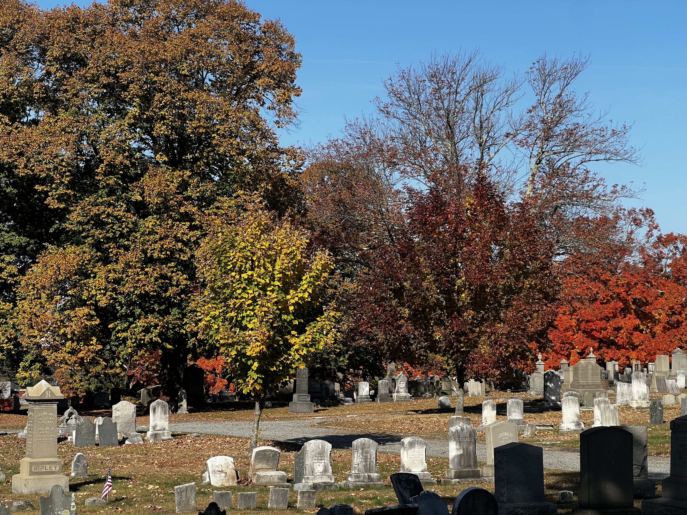
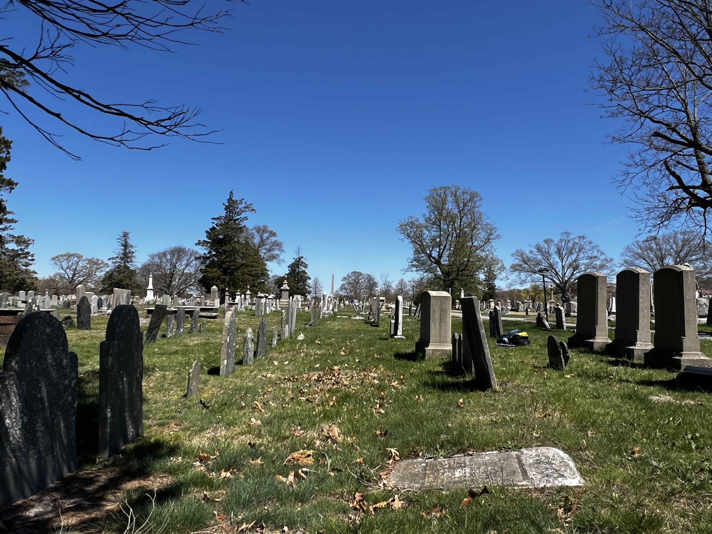
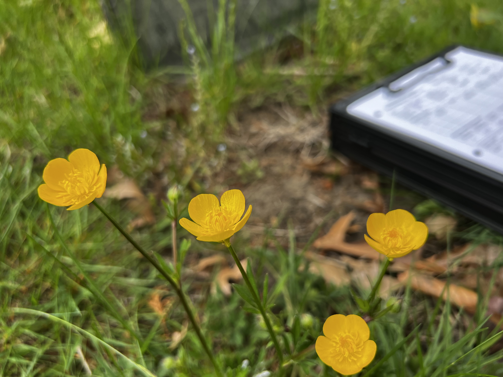
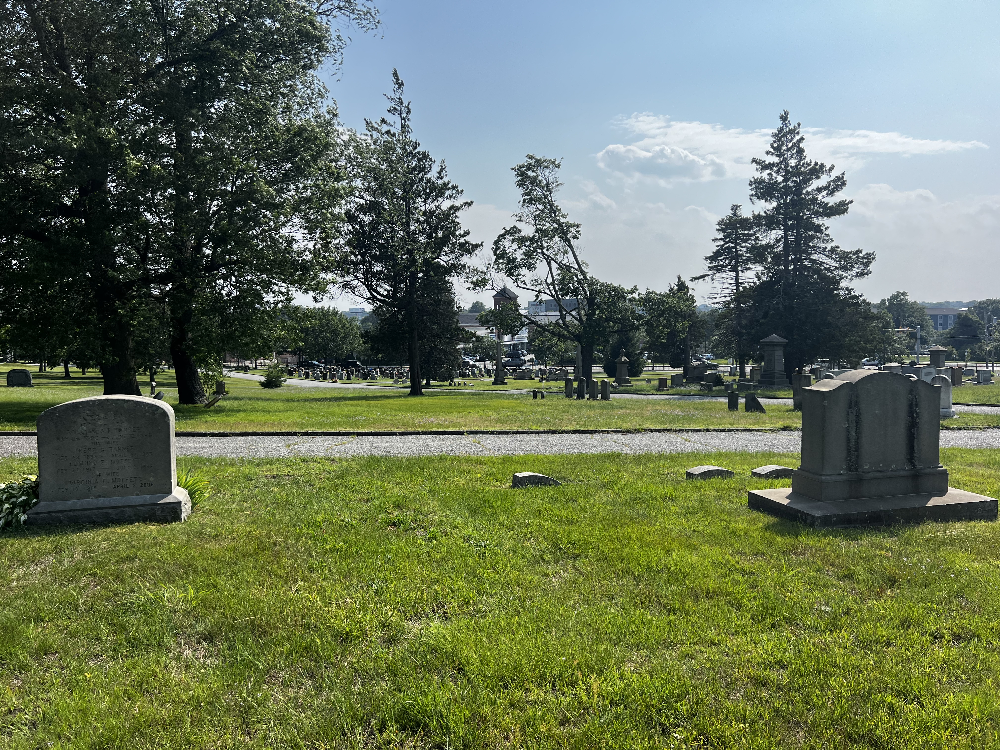
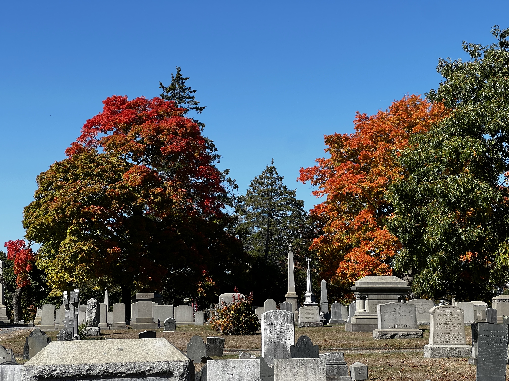
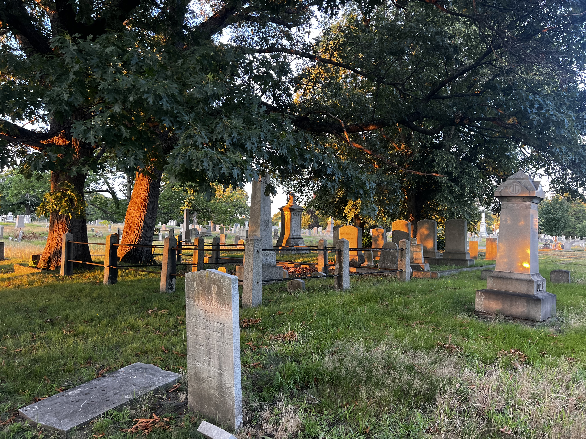
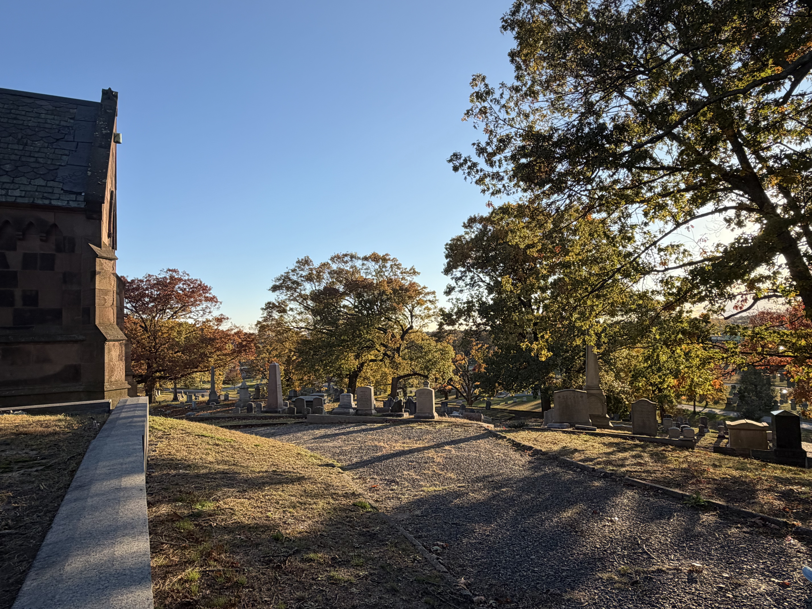
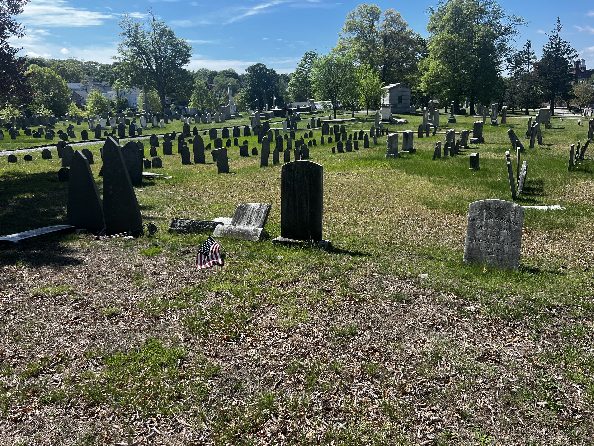

The NCPH working group format includes the sharing of “case statements” which are personal statements that explain each participant's relationship to the topic of the working group.

Case Statement Questions for everyone:

- Who are you and what is your professional background?

- What is your current experience in cemeteries (what is your job, role, or research area of interest?)

- What is the long term goal or vision for the work you’re doing?

- What do you hope to learn from or be in dialogue about with others in this cohort?

- How do you define an operational historic cemetery?

Case Statement Questions for Cemeterians

- Does your cemetery already do programming? If so, provide a short summary of those programs and your current approach to thinking about developing programming.

- Describe the community where your cemetery sits and the demographics of the community you serve.

Case Statement Questions for Researchers

- What do you do in the cemetery space?

- What if any collaborations do you do with cemetery management/personnel?

- Where do you see yourself in the community where your cemetery sits?

# Case Statements

## Kim Bearden

Coming soon

## Adrienne Burke

I'm an attorney, urban planner and preservationist. I am co-owner of a consulting practice, Community Planning Collaborative, that operates at the intersection of planning, preservation, and public history. We are focused on elevating the voices, histories, and cultures of communities that have too often been left out of the planning process. Our work shows up as everything from heritage trails and oral histories to zoning policy and community engagement. I have been working professionally with historic cemeteries since my first municipal planning job working with a c.1798 cemetery in Northeast Florida.

I came to cemetery work through preservation and community history (and a personal love of cemeteries since I was a kid!). We are currently involved or have been involved in several municipal cemetery projects in Florida over the past year. Right now we are in process with Evergreen Cemetery, a historic African American cemetery in West Palm Beach, Florida. It's a multi-layered effort: grave marker documentation, community engagement, research, and working toward a vision for what sustainable, community-led stewardship actually looks like.

We are also working alongside the community and City of Jacksonville (Florida) on memorialization of historic Mt. Herman Cemetery, a historically African American cemetery which was destroyed to create a public park. We facilitated a restorative justice circle around memorialization of the site, and I’ve been working on identifying names of those buried at the site through historic research. I’m currently up to 1200 individuals interred at Mt. Herman and still researching. We have assisted the City with obtaining a grant to have ground-penetrating radar completed (coming later this year) and memorial signage installed. 

Lastly, we worked with the community of Wimauma, Florida and Hillsborough County on a local landmark designation report for Wimauma Memorial Cemetery, a rural African American cemetery that is still operational. We also consult with different community organizers and groups working with historically Black cemeteries on a volunteer basis. Previously, I’ve worked on historic cemetery master plans and with organizing a cemetery friends group.

My long-term vision is community-led stewardship. Historically Black and underserved cemeteries should be recognized, resourced, and restored in ways that the communities they belong to actually have a hand in shaping. That means policy change, capacity building, and making sure these places are understood as heritage sites and outdoor museums, telling the stories of people who built and shaped towns and cities and are part of a continuum of living culture.

Many historic African American cemeteries in Florida are no longer operational. Questions of cemetery ownership are often unclear, municipal-level support varies, descendant communities may have been displaced or relocated, and often cemeteries have been intentionally destroyed or erased. Ensuring descendant-led engagement and stewardship is a priority for these spaces, and how to integrate and implement memorialization, programming, and long-term preservation strategies can be complex. I am hoping to learn from other communities and cemeteries to share back resources and ideas with descendant communities to help facilitate their goals.

At the basic level, an operational historic cemetery is one that is still accepting interments. But from a broader perspective, it could mean one that is still actively serving its community: ongoing maintenance, memorialization, and living programming that connects people to the history held there. 

Our work in the cemetery space is part research, part community engagement, part advocacy. We help document what's there, both physically and historically, and we help communities figure out what they want to do with that documentation. I'm also interested in the policy and planning side: how do we make sure these places are legally protected, particularly at the local government level.

Our work is collaborative by design. We work alongside descendants, community stakeholders, researchers, preservation professionals, and local government staff. We view ourselves as facilitators, not experts. I see myself as a servant of the work, not a leader of it. I consider it an honor to be able to help restore dignity and identity to people long buried and to serve their descendants in realizing their goals. The community that this cemetery belongs to, they're the ones with the authority and the vision. My job is to help make sure they have the tools, the research, and the resources to carry that vision forward and ensure that the cemeteries are treated like the sacred spaces they are.

## Sharon Carpentier

Coming soon

## Savannah Cravey

My name is Savannah Cravey, a current Ph.D. student in history at George Mason University. I have a M.A. in public history from Georgia Southern University and a B.A. in history education from the University of North Georgia. As part of my M.A. program, I completed an exhibit titled “Emerging Freedom: Mapping African American History in Bulloch County,” exploring formerly enslaved burial sites across Bulloch County and how cemeteries historically and presently act as places of community building. As I start the early preparations for my dissertation, I am exploring the differences between Virginia and Georgia in how communities and the state treat and engage with Black cemeteries. Through this work, I am engaging with the power that local historians have in preserving, promoting, and producing scholarship on the history of cemeteries. This includes the importance of cemetery groups and local activists. Through this work, I strive to shine a light on how cemeteries are places of memory, not just places of mourning.

By participating in this working group, I am hoping to collaborate with other researchers and cemeterians on how best we can move this field forward. By exploring these conversations, we can create collaborative communication, provide educational opportunities, and provide resources for cemetery personnel and researchers, along with the public. Through collaborative efforts, we can create spaces to promote cemetery studies on a large-scale effort. By bridging the gaps between cemetery scholars on all levels, we can better educate the public on how to get involved in cemetery preservation. We can use this space to further distinguish cemetery studies from general death studies, creating a connected but distinct area of study. By focusing on all levels of cemeteries, the definition of an operational historic cemetery goes beyond large scale developed cemeteries and includes community-led cemeteries. Much of my research centers around small rural cemeteries and those that have been displaced for urban centers. These sites are at risk of being completely forgotten by anyone outside of the community that they represent. By expanding our view of ‘operational,’ we are able to include cemeteries that are still in use, but do not have large scale operations and staff.

As a researcher, I take an interdisciplinary approach to cemetery studies, including history, geography, and archeology. Through my work, I strive to promote the importance of local history. Living in Georgia, my work centered around the county I was in for graduate school. Now that I have moved to Virginia, I want to find ways to combine both my new home and my original home state. Through a local history lens, I uncover stories of forgotten cemeteries, and ones that to others may appear forgotten but are still in operation. Through looking at cemeteries as places of community building, we see the last remnants of communities long since passed. As the cemetery stands as the last physical space of many forgotten Black communities. In my past research, none of the cemeteries I worked with were backed by any other organization outside of the Protestant church they were connected with. This meant there was little room to collaborate with cemetery personnel. I am hopeful that through this working group, I can gain a better understanding of how to connect with cemetery personnel. My goal in my research is to bridge the gap between these secluded or completely forgotten cemeteries and the broader historical context. By showcasing the reality of our most vulnerable cemeteries, historians, activists, and broader cemeterians can gain a better understanding of the field itself.

As a young child, my Mema would make up stories about people buried in the cemeteries we use to visit. While she did not have the historical methods or tools to back up her stories, she understood the power of remembering and memorializing each person buried in those cemeteries. The goal for my work, and those I collaborate with, should always be to educate, and promote those stories. Cemeteries are some of the only places of memory that exist for most of us when we die. Their stories may be harder to find, but their names may be forever etched in stone. Each individual that engages with a cemetery, should understand the power of the place through the history of those buried there.

## Aaron Comte

Coming soon

{fig-align="center"}

## Kurt Deion

My name is Kurt Deion, and I have an M.A. in History from the University of Massachusetts Boston, as well as a B.A. in History from Bryant University in Smithfield, Rhode Island. Cemeteries have been a major focus of my life since age nine, when I started seeking out the graves of historic figures. History and cemeteries have intersected at many points in my career. Right out of high school, my first paycheck came from documenting gravestones as an intern with the Rhode Island Historical Cemetery Commission. I also led crypt tours and worked on history programing as an intern with the United First Parish Church in Quincy, Massachusetts, and interpreted history at Hancock Cemetery as an employee of the City of Quincy. Currently I work as the history education manager at Historic Congressional Cemetery in Washington, D.C.

Congressional Cemetery is one of the more unique sites of interment in the United States. Its name is a misnomer, owing to the fact that the U.S. Congress was the biggest customer of plots in the early 1800s. Its 35 acres of land are owned by a church, but they are located over a mile apart. Since 1976, the cemetery has been operated by a non-profit organization that leases the property from the church. Burials still occur at the cemetery, but much of its calendar is filled by an array of programs that focus on the living. What was once a decaying, endangered cemetery is now a stable burial ground, arboretum, and events space with multiple communities. The cemetery’s most frequent visitors are members of our paid, off-leash dog-walking program, with some walkers visiting multiple times a day, every day. These folks are individuals, couples, and families. As an active cemetery, we also have many bereaved families that come to bury loved ones and continue to visit them. Because of this duality, many community members seek out the cemetery for burial services. And sometimes it is the reverse – people who first come to the cemetery for burial purposes subsequently engage with our events and become members of our community.

The programming slate at Congressional is robust. Our death doula in residence hosts a monthly death café, which provides people a space to engage in an open-ended conversation about death. Our Tombs and Tomes book club and our summer movie nights have a dedicated following. 5k races, yoga sessions, tours, yappy hours, markets, pride festivities, string concerts, stand-up comedy, and interpretive theater comprise some of our robust programming slate. Some of our programming is meant to both cater to a portion or portions of our local community while tapping into our status and history. For example, Congressional has a Gay Corner – a section of the cemetery where many LGBTQ+ individuals and couples have chosen to be interred together in solidarity. We in turn host various LGBTQ+ focused events, such as our Gays & Graves pride festival and an occasional LGBTQ+ lecture in our Speaker Series.

In my capacity as history education manager, I coordinate the tours offered to the public. This includes our pre-scheduled tours, as well as privately-booked tours. I also oversee the history-related content posted to the cemetery’s social media accounts. Usually I research the content and write the posts myself, but sometimes I delegate to colleagues or write from research they submit to me. As a member of our Events, Programming, Education, and Marketing Team, I also help lead school field trips to the cemetery and assist with the planning and execution of events. Being an employee of a small non-profit, I also sometimes assist with other responsibilities such as K9 Corps tag-checking and manning the gate during funerals.

I regard an operational historic cemetery to be a cemetery that: (A) is over 100 years old; and/or (B) has local or national significance; while also (C) actively conducting burials. Congressional Cemetery is 219 years old. It has significance in the Hill East neighborhood of D.C. and is remarkable for being the first cemetery of national memory in the U.S. Balancing the cemetery’s historic site status with its extensive programming slate while still conducting burials is quite a task. As a member of this cohort, I hope to gain insights from others on how they balance seemingly competing goals and instead make them complimentary. I’d like their outside perspective on whether or not Congressional Cemetery is striking the right balance in being this Swiss Army knife of an institution.

My goals for my work at Congressional Cemetery includes continuing programming that appeals to our community while also respecting the cemetery non-profit’s values and its status as an active burial ground. I would also like to compile more research about the cemetery’s rise from its late twentieth-century decline, including but not limited to the history of the development of our public programs.

## Megan Hahin

Coming soon

## Annalisa Heppner

My name is Annalisa Heppner, I have a MA from the University of Alaska Anchorage in Anthropology and a BA in Anthropology and English from the University of Tennessee. I currently serve as the City of Providence City Cemetery Director, but before becoming a cemeterian I worked as a field and museum archaeologist in state, federal, acadmeic and private contracting contexts, largely in Alaska and the Pacific Northwest.

As the City Cemetery Director, I manage multiple cemeteries in Providence, Rhode Island. Our two largest are Locust Grove, which is eight acres, and North Burial Ground which is 110-acres. North Burial Ground is main focus of my work. Founded in 1700, we’re still an active cemetery facilitating around 200 burials per year. The mission of the North Burial Ground is to remember the deceased, comfort the living, and preserve the historical cemetery as a destination for the community. I like to refer to our “mission verbs”: Remember, Comfort, Preserve, when I do my job. I manage all the cemetery operations, handle strategic initiatives, advocate for the cemetery in the community and to the larger City of Providence administration, and build our public programming.

North Burial Ground serves the families of the Providence metro area. We have three major constituencies: as-need families who are purchasing a grave because of a loss; pre-need families who are pre-planning their own burials or who previously purchased a family lot; and “cemetery enthusiasts. Our as-need burial program serves predominately Black and Latino families, many of whom are dealing with the first loss in their families. Our pre-need largely serves Greek and Armenian community members who purchased large lots next to their neighbors and members of their faith community in the mid-20th century (reflecting major historical immigration waves to Providence). Our “cemetery enthusiasts” are the folks who show up for programming, cultural descendant groups like the Sons of Union Veterans of the Civil War, and the Daughters of the American Revolution, local high school and college students, and our fledgling “Friends of North Burial Ground” group.

NBG does about 40 programs a year. All but three of them are free to the public, and we have a 10,000.00 per year budget for programs. Programs are staffed by myself and a seasonal program-coordinator who works 28 hours per week, from mid spring to early winter. We host a monthly book club; we have monthly docent tours spring-fall; we do two “Earth Day is Every Day” events (one on Earth Day, one in the Fall) we host “Cemetery Scenes” a film screening program; we host a program called “Let’s Play” where we play a collaborative game themed around grief, growth, or mystery. We also have three major ticketed programs-Sunday 1899-a Victorian Picnic, the Mausoleum Hill Sessions a concert and art market in October; and the annual Ghost Tour-where local actors perform as notable interments, usually on a theme.

We fill out the rest of our programming slate with opportunities that arise through community outreach and collaboration. We use three programming pillars to guide how we select collaborators or build new programs: Arts & Culture; Environment; and Memorialization.

I’m also very proud of our academic engagement. We have research and student partnerships with Johnson & Wales University, Rhode Island College, Brown University, and Tulane University.

After 326 years of continuous operation, North Burial Ground is looking towards the end of its life as a place for as-need full burial. We’re thinking about what our next phase of the cemetery might look like-an increased reliance on the permanent placement of cremated remains (which is behind the national curve here in Rhode Island), increased use of the cemetery as a greenspace, and a deeper activation as a cultural and historical space. My goal for our public facing work is that when North Burial Ground reduces is active burial service that the other facets of the cemetery are so engrained in our community that it would be inconceivable for the City to stop financially supporting North Burial Ground, letting us rely on only our perpetual care trust.

I’m interested in learning from the group about how to build administration buy-in for public programming (whether the administration is a board, a mayor, a university) beyond what we currently have, which is enthusiasm, but relatively little institutional or staff support. I’m interested in hearing from other cemeterians with strong non-profit partnerships. I’m also really interested to hear from our non-cemeterians about how they came to cemeteries, the kinds of work they find fulfilling, and to hear the challenges they have working with cemetery leadership. I like to think of North Burial Ground as a community facing place, but I know there are things that I do that might hinder the experience of folks looking to use NBG as a community resource. I’m also hoping to discuss when NOT to be open to the public. Have any members of the cohort had experiences where openness backfired or caused damage? What were those experiences like, and how was repair made, if repair was possible?

I define an operational historic cemetery as a cemetery with an historic component that is still serving families who have suffered a loss and that has a management structure. I think this helps expand beyond the idea that an operational cemetery must be doing burial or inurnment, but the act of caring for the space in service of the bereaved is what makes a cemetery operational.

{fig-align="center"}

## Greg Howard

My name is Greg Howard, and I currently serve as the Administrative Director/Superintendent at River Bend Cemetery in Westerly, RI. River Bend incorporated back in 1849, and we do about 150 interments per year. I have held my current position since 2017, and have been working at this same cemetery for a total of 15 years. I started working at River Bend part-time while studying Landscape Architecture at the University of Rhode Island, and eventually worked my way up the ladder. Therefore, I have done just about every job in the cemetery; from mowing, line-trimming, and grave digging, to now being responsible for the entire operation of the cemetery. Today, my role consists of creating and managing the budget, all of the record keeping, and overseeing any new development. I also personally handle just about every lot sale, coordinate the burials, plan and supervise all programming, and oversee 3 full-time groundskeepers, 4 seasonal workers, and 2 office staff members. We have a great team in place at RBC, where most of us have been working together for many years.

River Bend is a visually stunning 54-acre cemetery situated along the picturesque Pawcatuck River, not far from Watch Hill and the Westerly beaches. RBC was founded with the simple mission of providing everyone in the community with a peaceful and beautiful space to bury and memorialize their deceased loved ones. We are a private, non-profit cemetery and completely non-denominational. Everyone is welcome. Westerly is known for having a very large Italian-American population; however, we are proud to have the opportunity to serve families from all cultures, religions, and ethnicities. Westerly, on average, is a relatively affluent area, however, there are still many lower and middle-income individuals and families in town, and RBC strives to have affordable options available for each of them. The cemetery has a substantial perpetual care fund, which allows us to have an adequate and qualified staff, keep our prices reasonable, and to keep the highest of standards in terms of serving each of our families, as well as maintaining the landscape.

For me personally, my primary purpose in this profession is always to serve the families in my community to the very best of my ability. I think this job requires us to wear a lot of hats, and we all obviously have our strengths and weaknesses. My biggest strength is my ability to connect with people, make them feel seen and heard, and reassure them that they and their loved ones are in the very best of hands when they come to our cemetery. It is also incredibly important to me to leave the cemetery in a comprehensively better position than it was in when I took over. Re-working outdated policies and procedures, paving and re-paving roads, renovating all of our buildings, updating our equipment, responsible new development, and preparing for future sea level rise are several steps we have already taken, and there is still plenty of work to be done.

Programming is an area that I would say is quite high on the list in terms of my weaknesses, which is the main reason I am so excited to be a part of ‘As Above/So Below.’ I hope to learn some creative and different ideas for historical and cultural programming that we could possibly implement at our cemetery. Currently, we work with the Westerly Historical Society and the docents of The Babcock-Smith House Museum to host 3-4 tours a year that focus heavily on Westerly’s rich history in the granite industry and the amazing works of art that call River Bend home, which were created by the many talented sculptors who worked in the area in the late 19th-early 20th centuries. These tours have been incredibly successful and have helped generate many lot sales, stone cleanings, and other miscellaneous revenue for the cemetery, however, there is no question we could be doing more. River Bend is truly a beautiful place, filled with amazing art and history throughout, and we should definitely be doing more to celebrate that.

In closing, I would define an operational historical cemetery as being at least 100 years old, actively managed and maintained, and still serving families and the community in some capacity, which could be through offering burial or inurnment, historical and cultural tours and other programming, or monument and marker cleaning and restoration, or other services.

## Sara Lowenburg

Coming soon

## Amy Michael

My name is Amy Michael and I am an Associate Professor of Anthropology and Director of the Forensic Anthropology Identification and Recovery (FAIR) Lab at the University of New Hampshire. I consider myself a biological anthropologist broadly trained in bioarchaeology and forensic anthropology. At present, I serve the state of New Hampshire by assisting with unidentified human remains cases brought to the FAIR Lab by the Office of the Chief Medical Examiner and the State Archaeologist. I am interested in equitable solutions to resolve human identification, so my recent forensic anthropology scholarship has engaged with issues in identifying gender variant decedents, ethical and legal perspectives in legacy cases, and improving case resolution methods by incorporating forensic investigative genetic genealogy into case workflow practices.

My interest in cemeteries comes from an unidentified and/or unclaimed remains perspective. While New England has many marked cemeteries with marked Doe plots, it is often unclear who is buried in these plots, if they were unidentified or simply unclaimed by family, and if they can ever be re-associated with their names and/or matched to missing persons records. In the case of my state, New Hampshire, a medical examiner’s office did not exist until 1986 so it is unclear where unidentified skeletal remains were kept and analyzed (if at all) before this date. It is my working assumption that there are many people buried in these Doe plots that could be identified given the right assembly of information, labor, time, and resources. My long-term goal is to work through historical, archival, and forensic case information that may be useful in resolving missing persons and unidentified skeletal remains cases. I believe there must be some people who were buried before a match could be made to their missing person record (if it existed). Starting with mapping all public graveyards with Doe plots or unclaimed remains plots in the state is the (ambitious!) first step. I am currently measuring interest from students, local historians, and community members about this project.

I hope to learn from the others in this cohort who are actively involved in maintaining records, finding archival sources, and mapping cemeteries. Personally, I’m interested in cemetery maintenance and expanded cemetery tourism because I believe cemeteries are places where we can show extended respect for people after they have died. My forensic research is rooted in the twin principles of unbounded respect for decedents and insistence on dignified final disposition. To this end, I hope to learn from researchers and cemetarians about how they operate within their spaces given the constraints we all experience on time, labor, funding, and more.

## Christina Miles

Hello! My name is Christina Miles, and I am a recent graduate of Brown University where I studied Anthropological Archaeology and Museum Studies. Currently I am a researcher and Assistant Curator at Ancestral Bridges, a non-profit organization in Amherst, Massachusetts dedicated to uplifting the histories of the Black and Afro-Indigenous communities of Amherst and the broader Connecticut River Valley. Ancestral Bridges is a descendant-led living archive, where the testimonies of Black and Afro-Indigenous elders are centered in narrating the history of Amherst. 

At Ancestral Bridges, I lead the West Cemetery Community Mapping Project, aimed at uplifting the stories of the Black and Afro-Indigenous ancestors buried in the cemetery. Established in 1730, West Cemetery is the oldest historic cemetery in Amherst and contains somewhere between 2,300 – 2,400 burials dating from the early-mid 18th century to the early 2000s. While it is most famously known for being the gravesite of the poet Emily Dickinson, its landscape tells a much richer story of the Black and Afro-Indigenous presence in Amherst dating back to enslavement. Primarily concentrated in the southeast corner is the African American Burial Site, a segregated section of the cemetery that has gone under-documented by the Town archives. The Town of Amherst manages the cemetery and maintains its grounds, and it is a public space for community groups, independent scholars, academics, and local museums to research or host programing. While Ancestral Bridges has worked with Town officials to host events in space in the past, I do not work with them directly on my research. 

The Project’s goals are to document and map the Black and Afro-Indigenous headstones in the cemetery, refine the boundaries of the section that were last outlined in the 1990s, and to work with descendants to reinterpret the space. Previous preservation work has been done without proper consultation from the Black and Afro-Indigenous community, resulting in headstones being altered without consent and signage that speak of the community in the past tense, further obscuring their continued historical and cultural impact on Amherst. This project aims to combat this erasure through counter-mapping, reorienting how visitors traverse the landscape by centering Black and Afro-Indigenous perspectives. The project will produce content that may be used by Ancestral Bridges in their exhibit space. 

My interest in mapping historic cemeteries began with my undergraduate honors thesis at Brown University, where I utilized high-resolution GPS to survey a quarter of Grove Island Memorial Cemetery, the resting place of my ancestors as early as 1917 and where our relatives continue to be buried. In this thesis, I framed Grove Island Memorial as the heartbeat of the Grove Island Freedom Colony, a community of Black Texans who established the town shortly after Emancipation to protect themselves from anti-Black violence and establish economic security. As a churchyard cemetery it is managed by leaders at Grove Island African Methodist Episcopal Church, resulting in memorial landscape that is controlled by descendants. While my research into my ancestral burial ground has no cemented timeline, the goal is to continue to expand the working group of descendants to establish a communal preservation plan, including a private series of maps for descendants who no longer live in the region to experience the cemetery digitally. 

Through these two projects, I have been able to approach the cemetery space both in the position as a descendant and as a scholar. It is in the intersection of these identities that I have formulated my definition of an “operational historic cemetery.” While I acknowledge there is a significant difference in labor and fiscal responsibility for a cemetery that is actively burying decedents, I still believe that cemeteries continue to be “operational” even after the last plot has been filled. Through my work at Ancestral Bridges, I have seen the dissonance between managers who deem the cemetery to be inactive and the direct descendants who continue to visit their loved ones. When preservation plans conflict with descendants’ desired experiences at the site, it can rupture the relationship between cemetery personnel and the bereaved who find solace in these spaces. Further, my experiences at Grove Island Memorial provided a model for how wholly community-managed cemeteries may function. As such, I view an operational historic cemetery as one that has served a historic community and continues to serve its descendants that use the space to grieve, organize their community, and remember their ancestors. 

Since I’ve never had the opportunity to work closely with cemetery managers and staff, I am very curious to hear about their experiences, especially when it comes to working alongside researchers doing community-based scholarship. How do you balance the immediate needs of your cemetery (i.e., managing future burials and funerals, maintaining the grounds and monuments) with descendant communities’ needs of the space? Are they one in the same, and where do they differ? As a young professional I would love to learn more from those further in their career as cematarians, and how researchers have managed to build meaningful professional relationships with cemetery managers through their work. Overall, I am excited to join this working group and learn more about the future of historic cemeteries!

{fig-align="center"}

## A.J. Orlikoff

My name is Anthony “A.J.” Orlikoff, and I currently serve as the Director of Programming at Historic Congressional Cemetery (HCC) in Washington, D.C., where I also served as Interim Executive Director in 2025. I have worked in this capacity since April of 2022. I hold both a BA and MA in History from Old Dominion University in Norfolk, VA and have built my career as a public historian focused on community-centered interpretation, historical and cultural programming, and using history as a method to engender a deeper sense of cultural context for the betterment of society today.

Historic Congressional Cemetery is a 35-acre active burial ground founded in 1807. The first cemetery of American national memory, HCC is the final resting place of more than 65,000 interred residents, including significant historic figures, veterans, activists, artists, and everyday Washingtonians. HCC is also an operational cemetery serving contemporary families and an active community space in the heart of Washington, D.C. My work sits at the intersection of public history, arts and culture, community engagement, education, and institutional sustainability.

Over my time at HCC, I have worked to help transform cemetery programming from a supplemental activity into a core institutional function. In 2025, HCC offered approximately 170 public programs with more than 13,500 attendees, alongside 14 private events, generating approximately \$267,000 in combined earned revenue. As of 2026, these programs are supported by a full-time team of four staff members dedicated to programming, marketing, education, and events. Our work includes a mix of free and paid offerings designed to ensure accessibility while also building long-term institutional sustainability for the cemetery.

Much of my work has centered on redefining how historic cemeteries engage modern audiences without sacrificing dignity or reverence for the dead. I am particularly proud of the continued development of Soul Strolls, our nationally recognized immersive theatrical program in which actors portray interred residents and guides lead visitors through lantern-lit performances across the cemetery grounds. Soul Strolls has become one of the cemetery’s signature interpretive experiences and serves as an example of how emotionally resonant, creative storytelling can deepen public engagement with history, memory, and place.

Beyond Soul Strolls, I have helped expand HCC’s programming into a broad ecosystem of cultural and educational offerings. These include Cinematery outdoor film screenings, speaker series and public lectures, 5K races and recreational events, children’s K-12 field trips and educational programming, book clubs, public art, death awareness initiatives, commemorative ceremonies, LGBTQ+ signature programming, environmental stewardship initiatives, and large-scale public festivals. I believe strongly that historic cemeteries must function as living civic spaces that foster public ownership, community identity, and cultural connection if they are to remain relevant and financially sustainable in the 21st century.

The community surrounding HCC is extraordinarily diverse and reflects both the complexity and contradictions of Washington, D.C. We serve grieving families arranging burials, long-standing neighborhood residents, dog walkers, tourists, historians, artists, veterans, school groups, LGBTQ+ audiences, environmental stewardship groups, and audiences who may never have previously considered visiting a cemetery. One of the central challenges and opportunities of my work is balancing the solemn responsibilities of an operational burial ground with the reality that modern audiences increasingly seek participatory, experiential, and emotionally authentic forms of public history and culturally programmed engagement.

My long-term vision is to help establish operational historic cemeteries as essential components of a community’s cultural infrastructure rather than solely insular sites of mourning and grief. I believe cemeteries can and should function simultaneously as sacred spaces, centers of historical interpretation, environmental assets, and community gathering places. In many ways, I view public programming itself as an act of preservation: the more deeply a community feels connected to a cemetery, the more likely it is to advocate for its protection, relevance, and future sustainability.

I am particularly interested in being in dialogue with others about the future ethics, philosophy, and operational realities of cemetery activation. As cemeteries face shifting burial trends, financial pressures, changing audience expectations, and evolving public attitudes toward death and memorialization, I believe our field is at a pivotal moment. In addition to my work at HCC, I am also involved with the International Cemetery, Cremation and Funeral Association’s Historic and Garden Cemetery Committee, where I collaborate with professionals across the cemetery field on questions surrounding interpretation, programming, preservation, and public engagement. I hope to learn from colleagues navigating similar tensions around institutional buy-in, financial sustainability, community expectations, and balancing openness with stewardship responsibilities.

I define an operational historic cemetery as a cemetery that continues to actively serve the living, whether through burial operations, memorialization, stewardship, education, or community engagement, while simultaneously preserving and interpreting the historic landscape under its care. An operational cemetery is not simply a preserved historic site; it is a dynamic institution that exists in ongoing relationship with its community and must continuously evolve to remain meaningful across generations.

## Kelly Perry

Coming soon

{fig-align="center"}

## Nancy Parode

I’m Nancy Parode, an independent scholar and writer currently affiliated with the National Coalition of Independent Scholars. I have a MA from Pace University in American History. I taught history, government, literature, and other subjects at the middle school and high school levels for several years.

My current research focuses on a Maryland cemetery that dates to around 1741 and is still in active use. Sacred Heart Cemetery, located in Bowie, Maryland, is part of a Catholic parish campus that sits on what used to be a Jesuit-owned plantation called White Marsh. In 2022, brush-clearing along the edge of Sacred Heart Cemetery led to the discovery of a few dozen fieldstone headstones and the realization that the cemetery likely contained many more burials than were listed in parish records.

Sacred Heart called in an archaeologist who specializes in Maryland Jesuit plantations. She did an initial survey and concluded that the fieldstone headstones were likely put in place to memorialize burials of enslaved people and that there were probably many more burials than there were headstones. Sacred Heart’s pastor got in touch with the Archivist at the Catholic Archdiocese of Washington, DC, (ADW), formed a Cemetery Committee, and kicked off an effort to restore the neglected parts of the cemetery, document and memorialize the people who are buried in it, and create ways to share information learned with interested communities, especially with descendants of the people the Jesuits simultaneously enslaved and evangelized. I serve on this committee.

We work closely with the White Marsh Historical Society (the descendants’ organization), ADW, neighboring Catholic dioceses, and subject matter experts in archaeology, erosion control, natural resource management, archaeological geophysics, and cemetery preservation. My specific research focus is on built structures on the White Marsh plantation and the surrounding neighborhood, because descendants have specifically asked for information about the places their enslaved ancestors lived and worked.

Over the past four years, our team, which is quite large, has examined existing burial records across several counties and created a database of all known burials at White Marsh/Sacred Heart. Many sacramental records were lost in an 1853 fire, so the earliest White Marsh burials are likely to remain undocumented. We have also initiated efforts to clean up as much of the cemetery as possible and put erosion control measures in place, as the cemetery sits atop a steep hill and we know that some of the burials are on the slopes. We have worked with the archdiocesan Archivist to digitize and preserve burial records; this effort has helped to launch a diocese-wide burial record digitization project. A dynamic subcommittee of descendants, parishioners, and researchers focuses on memorialization projects, outreach, and education opportunities. I serve on this subcommittee.

On June 19, 2026, we are hosting a community event. We will honor the enslaved ancestors who labored and lived at White Marsh. We will also unveil our first four outdoor historical storyboards, which share the history of White Marsh’s enslaved community. Family-centered activities, such as creating storytelling sticks, will follow. This event takes place on the Juneteenth holiday, which is also the sad anniversary of the day in 1838 when the Jesuits sold approximately 272 enslaved people to owners of Louisiana sugar plantations to keep Georgetown College afloat and deal with other financial issues.

Although this is my first experience conducting cemetery-related built structures research, I have long been interested in historic cemeteries. Maryland is home to many historic cemeteries, large and small. There used to be more, but the state has a long history of moving and/or paving over old cemeteries, especially African American cemeteries, to make way for parking lots, highways, and other structures. This, to me, makes preserving Sacred Heart Cemetery and memorializing the enslaved ancestors buried there even more significant.

Working with descendants, the parish community, ADW, and the many experts who have helped us learn more about the cemetery and those buried there has been and continues to be an incredible experience. Since I don’t fall into any of the categories I’ve just mentioned, I’m learning new things all the time, ranging from implementing best practices for cleaning headstones to adopting established models for descendant-led memorialization of enslaved ancestors.

Sacred Heart Cemetery is definitely an operational historic cemetery. New burials are a regular occurrence, and will be for years to come. The parish puts on religious events, such as the annual All Souls Day commemoration, in the cemetery. Cemetery tours have been a part of parish life for years because the chapel that anchors the cemetery was the site of two significant events in early American Catholic history: the Jesuits’ decision to found a Catholic college, today’s Georgetown University, and the election of Jesuit priest John Carroll as the first Catholic bishop in the United States.

Over the past four years, the familiar events and tours at the cemetery have expanded to include a new focus on the lives of those enslaved at White Marsh. Parishioners who lay their loved ones to rest in the cemetery now know that enslaved and free African Americans are also buried in this sacred ground. The All Souls Day event centers around known gravesites of the enslaved ancestors, the souls who were not afforded dignity or recompense in life. The new storyboards, located just yards from the cemetery, will share information about the enslaved families with descendants, parishioners, and visitors. We hope they will also serve as a pathway to reconciliation and healing.

In this working group, I hope to learn how fellow cohort members have navigated similar waters, balancing commemorating historic events, memorializing ancestors, supporting bereaved families, and inviting the local community to learn about and honor those buried in the cemetery. I would also like to find out how cohort members have addressed community concerns about reshaping official narratives, especially as uncomfortable, incontrovertible information about their cemeteries has come to light.

## Jordi Rivera Prince

Coming soon

## Spencer Roberts

My name is Spencer Roberts and I currently work as a Research Assistant Professor on the Cemetery Hill Project at Clemson University in Clemson, South Carolina. I hold a PhD in History from George Mason University where I specialized in digital history projects. I also have an MA in History and BA in History and English Literature from Brock University in St. Catharines, Ontario, Canada. I previously worked at Emory University and Georgia State University as a digital scholarship librarian, contributing to a wide range of projects from public health and physical anatomy to rural church documentation and monastery oral histories.

My involvement in cemetery restoration and preservation projects began when I volunteered to help clean up a historic African American cemetery in rural Georgia. I found the work both challenging and rewarding, requiring careful coordination of physical labor and application of thoughtful research practices. Over three years, my involvement grew to include coordinating monthly volunteer events, creating a presence on social media to support volunteer engagement, and expanding our work to other nearby cemeteries. I was thrilled when I learned of an opportunity to join Clemson University in a full-time role dedicated to cemetery work.

Cemetery Hill at Clemson University was first used as a burial ground in the early 1800s as part of the Clergy Hall and Fort Hill plantations. We believe that enslaved Africans and African Americans were buried on the site through the 1860s and that their descendants continued to bury loved ones with their families into the 20th century. In the 1830s, the Calhoun family created a family burial plot on the hilltop. Following the creation of Clemson University on the former plantation land, the institution established a cemetery on the hill for officers and faculty. This multi-layered history makes Cemetery Hill a unique opportunity to engage with the complicated history of the land and institution.

Our project team conducts research into Cemetery Hill on the Clemson campus, leads public engagement on the history of burial grounds, and supports preservation efforts regionally. I lead our cemetery preservation research and practice, which includes leading repair and restoration efforts at Cemetery Hill, providing consultation, and partnering with local communities to document and restore their cemeteries.

Each semester, I also teach an experiential learning fieldwork course in which students learn about and practice cemetery research, restoration, and preservation while contributing to a community partnership. In the process of teaching preservation and supporting community restoration, I also conduct qualitative and quantitative research on our practices. The partnerships provide an excellent opportunity to test applications of geospatial surveying, light detection and ranging (LiDAR), aerial imagery, headstone repair techniques, and cleaning solution coverage.

Our project’s broader goal is to contribute to ongoing research and discussion of institutional burial grounds through the lessons we can learn from the history of Clemson’s Cemetery Hill, which contains an operational historical cemetery and earlier burial grounds. We strive to inform our community about the significance of the site, its value to our shared history, and the importance of preserving historical burial grounds.

In pursuit of our mission to educate and support cemetery projects, I represent our team as a founding board member of the Southeastern Cemetery Consortium (SCC). The SCC serves to connect and coordinate organizations, institutions, project teams, private firms, and individuals working to document, restore, preserve, and memorialize historic cemeteries. We also provide resources drawn from various fields involved in cemetery work, instructional guides on cemetery preservation, and networking contacts across the southeastern United States. Partner organizations include universities, colleges, archives, libraries, museums, and non-profits that can support cemetery projects in some capacity. We also allow private cultural resource management and geospatial surveying firms to list their companies in our directory, which helps people assess their options for paid support. 

In my participation with this working group cohort, I hope to represent the perspective of an educational institution responsible for a burial ground and learn from professionals engaged in programming and ongoing preservation in operational cemeteries. Much of our work is focused on restoration and preservation of recovered cemeteries with no management structure, so I look forward to expanding my knowledge of practices suitable for cemeteries in different operational stages. I also hope to share more about the SCC and its role in cemetery research and preservation.

## Ella Scalese

My name is Ella Scalese, and I am a researcher and museum educator based in Philadelphia, Pennsylvania. I hold a BA in anthropology from Susquehanna University, and recently graduated with an MA in history from Temple University. My current research interests lie within the fields of public history, Philadelphia history, and death studies/human remains.

My work in museum education has largely influenced my interest in human remains and cemetery research; in a previous role as a museum educator at the Penn Museum, I was frequently tasked with interpreting human remains to K-12 students. This work inspired my interest in repatriation, death tourism, and human remains practices. Currently, I am in the process of transitioning into a new role as a Programs Assistant at the American Philosophical Society, a role which will continue my professional interest in public programming while also fostering my academic interest in nineteenth-century Philadelphia.

My current research focus is Laurel Hill Cemetery, a historic rural cemetery within East Falls, Philadelphia. My interest in the cemetery is sparked by the guide books which it produced during the 1800s in order to generate tourism — both as a play towards respectability politics, but also towards the generation of profit through the selling of plots. The production of these guide books by Laurel Hill Cemetery created a cycle in which the tourist and the plot buyer became synonymous. The visitor would become entranced by Laurel Hill Cemetery as a place of tourism, in turn becoming encouraged to purchase a plot at the cemetery, and vice versa, upon touring the cemetery, the plot buyer would often in turn become a faithful tourist and visitor.

As a researcher, my work within the space primarily involves working through the archives (while collaborating with the site’s archivist), as well as walking through and photographing the cemetery site. I work not only within the cemetery’s archives, but within other archives in Philadelphia that hold Laurel Hill’s records. As someone who both lives and works within Philadelphia, I orient my work towards the community, as I am especially interested in the role that Laurel Hill played as a gathering place and third-space. Today, I find that Laurel Hill acts similarly, hosting both touristic tours and healing grief walks for its community.

While my work primarily centers around nineteenth-century cemetery tourism, I hope to bring a contemporary aspect into my project in the long term. I am interested in the intersection between tourism-cultural identity-profit generation, particularly the way in which the preservation of historic sites is complicated by tourism. How might tourism positively or detrimentally affect historic cemetery preservation, while simultaneously generating the revenue that often makes that preservation possible in the first place? I specifically hope to be in dialogue with others in this cohort about what contemporary cemetery tourism might look like. In my own research, I am interested in considering how Laurel Hill Cemetery might play into the 250th celebration within Philadelphia.

I define an operational historic cemetery as a cemetery space that honors its historic heritage while simultaneously continuing to serve its community through burial practices in the present day, or maintaining past gravesites. While my definition arises from the perspective of the researcher, I am interested in understanding how a cemeterian might define a historic cemetery.

{fig-align="center"}

## Jana Silva

I am the Cemetery Administrator for Harmony Grove Cemetery in Salem, Massachusetts. Before I joined the cemetery field, I worked for twenty-two years in specialty veterinary medicine. Grief was part of my daily routine, honestly, even more so than what I deal with in my current position. That experience taught me a lot about how individuals and families deal with loss, remembrance, and commemoration. It continues to influence my work in cemetery and crematory administration.

Founded in 1840, Harmony Grove is a nonprofit, non-denominational cemetery recognized as a 501(c)(13) organization and covers fifty-seven acres. The cemetery also runs a crematory that has served the community since 1917. As Cemetery Administrator, I manage all areas of our operations, including business administration, burial and cremation services, grounds management, preservation projects, public programs, and community relations. I lead a small staff, collaborate closely with our twelve-member Board of Trustees, maintain connections with local funeral homes, and oversee the maintenance of several historic and operational facilities, such as the Blake Memorial Chapel, the administration building, the caretaker's house, barn, and maintenance garage.

Like many historic cemeteries, Harmony Grove serves both as an active burial ground and a cultural landscape with historical, architectural, horticultural, and community significance. While our primary responsibility is providing burial and memorial services, we also steward a landscape that reflects generations of Salem residents and broader themes in American history, funerary traditions, landscape design, and environmental stewardship.

Much of my work involves balancing the needs of an active cemetery with the responsibilities of preserving a historic site. Over the past two years, Harmony Grove has completed both a strategic plan and a cemetery master plan, establishing priorities for infrastructure improvements, historic preservation, landscape stewardship, burial inventory, and community engagement. We are now moving from planning to implementation, beginning with the first burial expansion project identified in the master plan. This transition requires careful consideration of operational needs, preservation goals, visitor experiences, and community expectations. For me, it is an exciting opportunity to help guide the cemetery's future while ensuring growth remains consistent with its historic character, mission, and long-term sustainability.

My long-term vision is to strengthen Harmony Grove's role both as a working cemetery and a respected community resource. I strongly believe we need to figure out how to continue to offer end of life services to the community. While providing those services, historic cemeteries can also connect people with local history, art, architecture, genealogy, horticulture, and environmental conservation. We must also be financially sustainable and effective in serving their primary purpose as places for burial, remembrance, and mourning. I, along with our staff and board of trustees, aim to create a model where preservation, interpretation, community engagement, and cemetery operations work together. This feel like a really big task but with the guidance of other professionals as well as colleagues that have gone through similar processes, it is achievable.

Harmony Grove is expanding our public programming initiative. Our programs include guided walking tours, lectures, virtual presentations, historical commemorations, and educational events focused on local history, notable individuals, and cemetery preservation. With Salem's strong historic and nonprofit community, we have partnered with local historians, scholars, and other nonprofits to present these programs.

I believe that historic cemeteries can be valuable educational resources while also being respectful places of remembrance. We see programming as a means to build community support, strengthen preservation efforts, and help the public understand the role of historic cemeteries in today's world.

Salem is known for its maritime history and the Salem Witch Trials, but it is also a diverse community interested in history, preservation, arts, culture, and civic engagement. The cemetery serves not just Salem residents but also families throughout the North Shore and New England who have loved ones interred here. Our audiences include descendants researching family history, preservation advocates, educators, students, nature lovers, and those seeking meaningful ties to the community's past.

One of the unique challenges facing Harmony Grove is its location in Salem, a city that draws hundreds of thousands of visitors each year, especially during Halloween. While tourism is a big part of Salem's identity and economy, it can create conflicts for a historic cemetery whose main purpose is to serve families and provide a respectful place for remembrance.

Unlike some historic sites in Salem, Harmony Grove is not a tourist attraction. We regularly hold burials, memorial services, and private moments of mourning here. Therefore, we constantly navigate the balance between public interest in Salem's history and our duty to uphold the dignity and solemnity of the cemetery. During Halloween, visitors unfamiliar with cemetery etiquette may treat cemeteries like entertainment venues, spooky destinations, or photography backdrops. Managing these expectations requires clear communication, careful programming choices, and a consistent focus on the cemetery's role as an active space for commemoration and education, not a tourist site.

Our goal is not to discourage public appreciation of the cemetery's history but to inspire visitors to connect with it in ways that are educational, respectful, and aligned with its ongoing purpose. Maintaining that balance is a central challenge of our work.

Through this cohort, I hope to learn from others working at the intersection of cemetery operations, historic preservation, public history, and community engagement. I am especially interested in how organizations balance public access with operational demands, build community support for preservation efforts, develop sustainable funding strategies, and handle differing stakeholder expectations. I also look forward to discussing how historic cemeteries can expand their educational and interpretive roles while remaining sensitive to their main function as places of remembrance.

I define an operational historic cemetery as an active burial ground that also serves as a historic, cultural, and commemorative landscape. Unlike cemeteries that only serve as historic sites, operational historic cemeteries continue to offer burial and memorial services while preserving their historical resources. The ongoing relationship between past and present sets them apart. New burials happen alongside centuries-old monuments, infrastructure improvements must fit into historic landscapes, and public programming needs to coexist with funerals and private memorials. In this sense, operational historic cemeteries are living institutions that evolve while caring for history.

I look forward to learning from colleagues facing similar opportunities and challenges.

## Kate Sullivan

Growing up in Northern Virginia, I practiced with my cross country team at the nearby Bristoe Station and Manassas Civil War battlefield parks’ trail systems, with our coaches warning us to avoid the historic cemeteries in the parks out of respect. The Confederate cemetery at Bristoe Station was formally dedicated in 2012, with a ceremony including Antebellum-era dress and Alabama soil and water as libations. The ongoing experience of engaging with sites of Civil War memory during recreation shaped my interest in Confederate monuments and cemeteries' impact on our understanding of the Civil War. Amidst an ongoing national dialogue about the role of monuments, how do historic cemeteries intersect with contested memory?

I hold a B.A. in History from Cornell University, and my undergraduate thesis interrogated how Confederate cemeteries in Virginia received priority for preservation in the 20th century when compared with the preservation of Black historic cemeteries. I argued that white Virginians wielded Confederate cemeteries to weaponize their grief against successes of the Civil Rights Movement, such as when Hollywood Cemetery in Richmond protested the construction of an integrated playground after Virginia began to desegregate schools. This research refuted the popular solution that removed Confederate monuments may be relocated into cemeteries because it would further concentrate white supremacist sentiments, and I advocated for additional studies of these spaces by organizations like Monument Lab and the Southern Poverty Law Center. I aim to continue this research in the coming years with additional sites and wish to probe questions such as: What happens at the intersection of contested grief and white supremacist sentiments? How may Confederate cemeteries serve as tools of white supremacy? How does urban planning and infrastructure development disproportionately affect burial spaces? I welcome dialogue around these questions and seek the input of cemeterians with practical experience about best practices our group may recommend regarding the intersection of genuine grief and exclusionary and hateful ideology. How can historic spaces respectfully balance descendants’ connection to a cemetery and also confront histories of exclusion and oppression? What tools can we develop for the commemoration and activation of historic cemeteries that do not replicate exclusionary power structures?

As a researcher for Monument Lab, a Philadelphia-based public art and history studio that seeks national narrative change around monuments, our team does not focus on any single cemetery site and is not working with any one community. Rather, we research many sites and collaborate with cemetery personnel across the country. This spring, in advising the Emmett Till Interpretive Center on the development and interpretation of sites related to Emmett Till’s murder, we meditated on the sacredness of absence at the East Money Church of God in Christ in East Money, Mississippi, where Emmett Till was nearly buried. The agency of his mother, Mamie Till-Mobley, halted the Mississippi burial and brought her son back to Chicago, where a public viewing allowed the case to become a catalyst for the Civil Rights Movement. In our advisement report, we deliberated how to best communicate the astounding agency the Till family and their relatives showed in stopping this burial to cemetery visitors.

Currently, Monument Lab is working with the state of New Jersey on a project called “Revolutionary Acts.” Led by artists Anika Grant and Nandi Jordan, we are facilitating a three-part performance series on the role of Black women during the Revolutionary War in New Jersey. One performance will be held at Johnson Cemetery in Camden, which was founded in 1854 for the middle-class Black community in Camden and was neglected by the city in the twentieth century. We are collaborating with Dolly Marshall, a local cemeterian who stewards the site, on how to best honor the cemetery’s non-Revolutionary War history and engage the Camden community in the program’s activations, such as through storytelling and dispersal of genealogy research resources. The program will potentially include libations to commemorate and open the space to the community. When juxtaposing this to the use of libations in programming at Confederate cemeteries, I hope our group may discuss how may rituals such as libations serve the memory and interpretation of historic cemeteries, and when do these rituals espouse exclusionary sentiments versus facilitate reparative work for communities? What constitutes hallowed ground, and how may cemeteries embody a form of civic religion?

In addition to planning programming at cemeteries nationwide through its public art and history projects, Monument Lab is considering broader research of cemeteries. In 2021, Monument Lab published its National Monument Audit, which served as a revolutionary study of the figures and themes most commonly represented in the American commemorative landscape, and our organization defines a monument as a “statement of presence and power in public.” Five years later, we are considering additional lines of inquiry to expand upon this study. I, as well as other members of our curatorial and research teams, are particularly interested in the possibility of auditing historic cemeteries. While in early stages, we are contemplating how an audit of these spaces may provide insights regarding how cemeteries function as or in relation to monuments. I seek both researchers and cemeterians’ thoughts on the possibilities, methods, and limitations that Monument Lab may consider when evaluating this potential project.

The preservation of historic cemeteries has not been equitable throughout the United States’ history. Many communities’ burial spaces have been razed by the construction of infrastructure and urban sprawl or under-maintained by the towns and cities they are within. These sites may not have the capacity to host programs or serve families; they may no longer be visible to the unknowing visitor. Yet these spaces and their histories are still operational in the memories of the community members whose history they contain and in less formalized or conventional means of commemoration. If a burial space has a historic component and is visited by community members or researchers whose mission it is to continue to share the space’s history and the narratives of those buried, it functions as an operational historic cemetery, and the absence of conventional visual markers or designated staff need not exclude a historic cemetery space from operating in historical research or in the community’s memory.

## Ana Swartz

My name is Ana Swartz. I will begin by acknowledging that I am a white woman and that I benefit from the unearned privileges and systemic advantages associated with my racial identity in our society. Born and raised in France, I have been a permanent resident of the United States for nearly ten years and have spent most of my career working in museums and nonprofit organizations in Salem, Massachusetts.

I hold an MA in Museum Studies from the Université de Liège (Belgium) and a BA in Art History from the Université Clermont Auvergne (France). I am relatively new to the cemetery profession, having joined Harmony Grove Cemetery in Salem, Massachusetts, as Development and Outreach Assistant in April 2025. I am also currently pursuing a PhD in Sociomuseology, an emerging field within museology that originated in the Global South and developed in response to the limitations of traditional museum practice in engaging marginalized communities and addressing social issues.

Since beginning my work at Harmony Grove, I have increasingly noticed the parallels between museums and historic cemeteries. Cemeteries are entering an exciting period of transformation, exemplified by developments such as the opening of a visitor center at Green-Wood Cemetery in Brooklyn and the growing adoption of museum-informed approaches by nationally recognized cemeteries. As available burial space gradually diminishes, many historic cemeteries are exploring new ways to remain relevant and financially sustainable while strengthening their role as community institutions.

Harmony Grove Cemetery is a nonprofit, non-denominational active cemetery and crematory situated within 57 acres of historic landscape. Founded in 1840, it was among the earliest rural cemeteries established in the United States. At the office, we sometimes joke that we are Mount Auburn Cemetery’s younger and less successful sibling, particularly since Harmony Grove was also designed by landscape architect Alexander Wadsworth.

In several respects, my work closely resembles museum practice. As a Development and Outreach Assistant, I support fundraising initiatives, donor database management, event coordination, historical records research, and community outreach, including social media management. A major focus of my position is expanding public engagement through programming and digital outreach. Since my arrival, we are on Instagram (since July 2025), we have organized two walking tours highlighting notable individuals interred at the cemetery, one online lecture, and this June, we co-hosted our first Death Café. Expanding our programming and strengthening community engagement are also connected to our fundraising goals, as the cemetery recently completed a master plan that includes long-term objectives such as landscape restoration and the creation of additional burial space.

For demographic information related to burial and cremation operations, I would refer readers to the case statement submitted by my colleague and Cemetery Administrator, Jana Silvia. In terms of programming, although the cemetery is located within a socioeconomically and culturally diverse area (including a portion that extends into Peabody), our audiences are predominantly white, older adults from upper-middle- to upper-income backgrounds. Many participants are descendants of, or otherwise connected to, individuals interred at the cemetery, lot owners, acquaintances of members of the Board of Trustees, local history enthusiasts, or followers of the interpreter and historian who currently leads our walking tours.

My long-term interests at Harmony Grove center on programming and community engagement. Inclusivity and social development have always been central concerns in my work as a museologist, and I believe cultural institutions can serve as valuable tools for addressing contemporary social issues. As I continue developing my career at the intersection of museums and cemeteries, I hope to help create programs that extend beyond traditional historical interpretation and engage a broader range of audiences and community needs.

I look forward to connecting with members of the group and learning more about both my role and the cemetery profession as a whole. Because there is not enough space to list every topic that interests me, I have selected a few questions that have been particularly relevant to my work lately.

One concerns the increasing adoption of museum practices by historic cemeteries and, specifically, the concept of openness. This development mirrors debates within museum history, where questions of access and inclusion have evolved from the exclusivity of sixteenth- and seventeenth-century cabinets of curiosities to the more participatory and community-centered approaches associated with New Museology in the late twentieth century. How can historic cemeteries strike an appropriate balance between openness and respect for the dead and their families? In the case of private cemeteries, how can staff encourage boards to embrace greater public engagement when board members often have deep personal and emotional connections to the institution and may therefore feel protective of it?

Another topic I would like to discuss with the cohort is the challenge of welcoming goths, taphophiles, and other enthusiasts of the macabre. It is an issue cemeteries encounter frequently in Salem, widely known as the “Halloween Capital” of the United States. How do institutions effectively communicate expectations for respectful behavior while avoiding assumptions or out-group bias toward visitors whose interests may differ from those of more normative audiences?

For me, a successful operational historic cemetery is one that maintains the balance that was hoped by the first supporters of the Rural Cemetery movement: caring for the deceased and their families while remaining accessible to the broader community as a place for reflection, contemplation, recreation, and connection to nature, provided visitors respect established guidelines. The historic dimension of cemetery operations includes not only the preservation of funerary monuments and landscape features but also the stewardship of archival records and other materials connected to the lives of those interred there. Together, these efforts ensure that individual and collective memories are preserved for future generations.

{fig-align="center"}

## Jon Taylor

Hello everyone, my name is Jon Taylor and I am Professor of History at the University of Central Missouri (UCM) in Warrensburg, which is located about 30 miles to the east of Kansas City where I have taught American history and public history for twenty-two years. My students have always been interested in cemeteries and their evolution, especially in Missouri. In 2023 UCM applied for a [Veterans Legacy Grant](https://www.cem.va.gov/legacy/grants.asp) from the Veterans Administration to fund graduate and undergraduate students to research, write, and publicly share the stories of United States Colored Troops that were laid to rest at the Fort Scott National Cemetery in Fort Scott, Kansas, and World War II veterans who are interred at the Missouri State Veterans Cemetery in Higginsville. The students created a database of veterans from each respective cemetery and then researched the lives of those veterans and completed selected veteran biographies from each cemetery. Those biographies can be found at the [Veterans Legacy](https://www.vlm.cem.va.gov/) Memorial homepage. [You can read some of the biographies and learn more about each cemetery here.](https://sites.google.com/ucmo.edu/ucm-vvh/home)

Another key element of the grant was to organize and host professional development sessions for 7th through 12th grade teachers in Kansas and Missouri to provide them with the training to be able to teach their students how to research and write biographies of veterans. We held professional development sessions in both Fort Scott and Higginsville where teachers met with the cemetery directors, then teachers were assigned one veteran’s headstone in the cemetery to visit. We retreated to an off-site location where the teachers, in teams, used curated packets of historical information about that veteran, to write a biography of that veteran. At the end of the professional development session the groups shared the biographies with the entire group.

We partnered with the [Greater Kansas City Writing Project](https://gkcwp.org/) and the [Midwest Genealogy Center](https://www.mymcpl.org/locations/midwest-genealogy-center), in Independence, which is part of the Midcontinent Library System in greater Kansas City, and using their networks and research materials they were critical partners to the project. Collaborating with these partners, our team drafted a handbook titled: [Honoring the Stories Behind the Headstones: How to Uncover the Stories of Civil War and World War II Era Veterans Interred in National Cemeteries](https://docs.google.com/document/d/1u-nC_ZuWlNwzzebBeN2qiQf5ICE9RuFg3HcOPQ_j_a8/edit?tab=t.0#heading=h.mzfokip1ovhf). We also [drafted lesson plans](https://sites.google.com/ucmo.edu/ucm-vvh/resources?authuser=0#h.hn9qghulm38w) that teachers can use in their classrooms.

I am interested in learning more about how we can engage in dialogue with family members or descendants of those who are interred in national cemeteries to better understand and share the life stories of those individuals. Partnering with the community that surrounds the cemeteries is critical too; however, with veteran cemeteries, many of the folks who are interred there are not from the surrounding community; consequently, establishing local/community connections to veteran cemeteries can be challenging. We are exploring the possibility of using the community networks established by the Veterans of Foreign Wars and the American Legion to assist with this. I am interested in learning what other strategies folks have developed to engage with family members/descendants of those who are interred in cemeteries.

Seeing cemeteries as places of community engagement might be odd, but it is key to remembering and honoring the contributions of the people who are interred there and understanding the historical significance of cemeteries. Engaging with K-12 community members is an important audience, but I am also interested in developing engagement with other community members and organizations. Ultimately, I wonder what thoughtful historical interpretation of cemeteries should look like? How does this change when a cemetery is still actively receiving internments versus a cemetery that is no longer taking internments?

I look forward to meeting everyone and to our upcoming discussion sessions.

## Jessica VanLanduyt

I serve as Vice President of Experiences and Engagement at Historic Oakland Foundation (HOF), the nonprofit that preserves and activates Historic Oakland Cemetery in Atlanta, Georgia. I am in my fifth year in this role and hold a Master of Heritage Preservation with a concentration in Public History from Georgia State University. Before joining HOF, I served as Senior Vice President of Guest Experiences at Atlanta History Center (AHC). Earlier in my career at AHC, I managed four historic house museums and developed a deep appreciation for how historic sites can connect with and serve their communities. That perspective shaped my approach to public history and ultimately led me to HOF.

I oversee HOF’s programming and marketing teams, including adult and family programs, education and youth development, volunteer programs, marketing and communications, private events, the visitor center, and the Oakland Store. Our youth workforce development program, Oakland Roots Academy, recently received the 2026 History in Progress Award and an Award of Excellence from AASLH. The program serves teens from Title I schools across metro Atlanta by providing paid work in preservation and horticulture, hands-on professional skill building, and exposure to careers in the green, preservation, and history sectors.

Our long-term goal at Oakland is to continue shaping a place that serves and strengthens its communities. That means responding to community needs, providing civic and social space, creating a safe and welcoming environment, and offering programs that communicate Oakland’s history, significance, resources, and relevance locally and nationally. I hope to engage in dialogue about emerging best practices for community building and engagement at historic sites and cemeteries. We are currently developing a three-year strategic plan for programs and audience growth focused on civic and community engagement, expanded partnerships, and reaching new audiences. I hope this working group will help advance that plan and its goals.

I am also eager to share HOF’s work in community engagement and programming and to discuss how our new Visitor Center, which opened in April 2025, was designed with community at its core. I define an operational historic cemetery as one that actively welcomes the public through educational and public programs, engages descendent and local communities, contributes to the historic built environment, and may still serve as an active burial ground.

Oakland Cemetery is one of Atlanta’s most significant historic landscapes and an active cultural institution that serves as a community anchor for the diverse neighborhoods surrounding it. HOF has developed a robust portfolio of programs that use the cemetery as a platform for education, preservation, arts, and community connection. These programs are designed to welcome our communities into a shared space while advancing the Foundation’s mission to preserve, restore, enhance, and share Oakland with the public.

Oakland’s programming is intentionally designed to be community centered, using the cemetery’s historic landscape as a welcoming space where people can connect across neighborhoods, backgrounds, and generations. Every initiative is built around the idea that

shared stories and shared spaces strengthen community bonds. By inviting constituents to learn together, celebrate together, and experience the site in new ways, Oakland creates opportunities for meaningful connection and fosters a sense of belonging. Its programs bring people together not just to explore history, but to build relationships, deepen neighborhood ties, and experience the cemetery as a vibrant third space. Oakland Cemetery currently offers a wide range of public programs that interpret the site’s history, architecture, and cultural significance while fostering meaningful community engagement. Core program areas include:

- Daily guided tours that illuminate Oakland’s history, landscape, and the stories of the residents. These tours serve thousands of visitors annually and provide an accessible entry point into the site’s history and meaning.

- Educational programs for K–12 students, including Title I outreach, curriculum aligned field trips, and youth development programs such as the award-winning Oakland Roots Academy career exposure program.

- Community events such as seasonal festivals, neighborhood open houses, and public gatherings that invite residents to use the cemetery as a welcoming public park.

- Arts and Cultural Programming including performances, installations, and creative partnerships that activate the landscape and highlight the stories embedded in the site.

- Preservation and Volunteer Programs that engage community members in monument cleaning, landscape restoration, and stewardship of historic resources.

HOF’s approach to program development is grounded in community- and audience centered planning and a commitment to DEIA principles. The Foundation actively seeks input from residents, educators, and neighborhood leaders to shape new initiatives. In 2023, HOF hosted open houses for six neighborhoods to better understand community needs and aspirations. This participatory model ensures that programming is relevant, inclusive, and reflective of the people who live closest to the cemetery.

Oakland sits at the intersection of several historic and culturally rich Atlanta neighborhoods. These communities are diverse in race, income, age, and cultural identity, and many are experiencing rapid redevelopment and demographic change. The neighborhoods most directly connected to Oakland include, Grant Park - a historic residential neighborhood with families, long-term residents, and increasing density; Cabbagetown - a former mill village known for its strong arts community and distinctive neighborhood identity; Reynoldstown - a historically Black neighborhood undergoing significant redevelopment and demographic shifts; Old Fourth Ward - a neighborhood central to Atlanta’s Civil Rights history and now one of the city’s fastest growing neighborhoods; Summerhill - one of Atlanta’s oldest neighborhoods, currently experiencing major commercial and residential redevelopment; an Peoplestown - a historically working-class, predominantly Black community facing displacement pressures.

{fig-align="center"}
